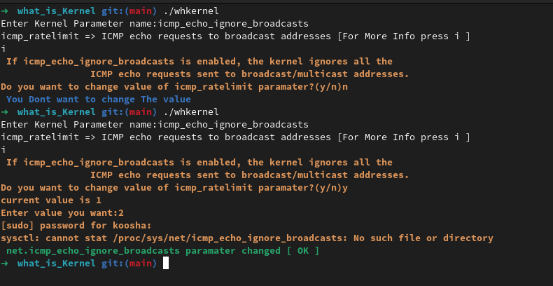

# Kernel?



what's Going on in Linux Kernel

## INFO

with this script:

1- Get information About Kernel parameters 
2- You can change Parameters of Kernel


## Install 

just Run install


```
./install
```


## Uninstall 

```
cd /opt && sudo rm main.zip && sudo rm -rf what_is_Kernel-main && sudo rm /usr/bin/whKernel
```


## TODO

- [×] Net core
- [×] ICMP
- [×] NEIGHBOR
- [×] CONFIG
- [×] Routing
- [×] TCP
- [×] IP fragmentation
